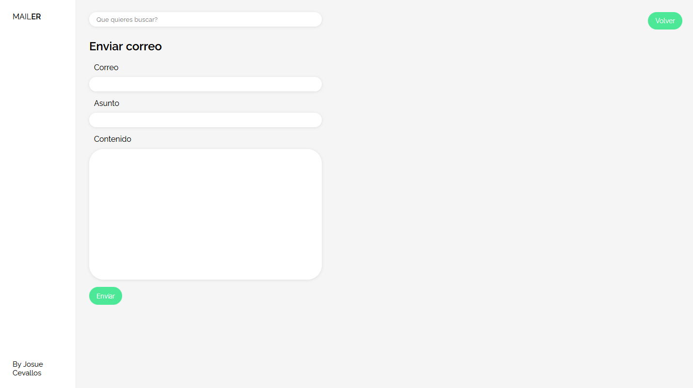

# MAILERAPP

## DESCRIPCION

Este proyecto es una aplicación email en la cuál el usuario puede enviar correos y en la página de inicio 
puede ver el historial de los correos.
Esta creado con flask, que es un micro framework basado en python. Flask permite crear aplicaciones web.

Para la creación de la base de datos he usado mysql y para el servicio de correos he utilizado la plataforma de SendGrid.

## TECNOLOGIAS UTILIZADAS

* __Flask__
* __Werkzeug__
* __Mysql__
* __SendGrid__
* __HTML__
* __CSS__

## LINKS Y RECURSOS UTILIZADOS

* __Udemy__
* __Stackoverflow__

## CAPTURAS DE PANTALLA 

* Inicio

* Enviar nuevo correo

-----------------------------------------------------------------------

## DESCRIPTION

Is a simple email aplication where the user can send emails and in the home page he can see the emails history. 
Is created by flask, which is a micro web framework base on python. Flask allows to create web aplications.

For the database I used mysql and for the email service I used the SendGrid platform.

## KEY TECHNOLOGIES USED

* __Flask__
* __Werkzeug__
* __Mysql__
* __SendGrid__
* __HTML__
* __CSS__

## LINKS AND RESOURCES USED

* __Udemy__
* __Stackoverflow__

## SCREEENSHOOTS 

* Home page

* Send new email

